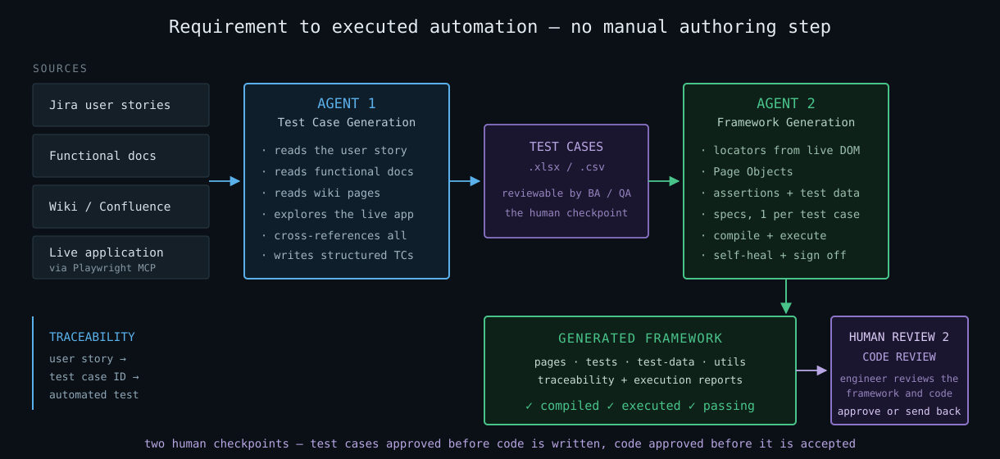
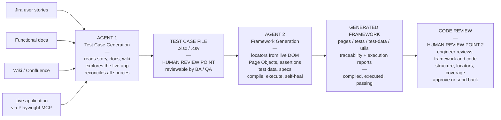
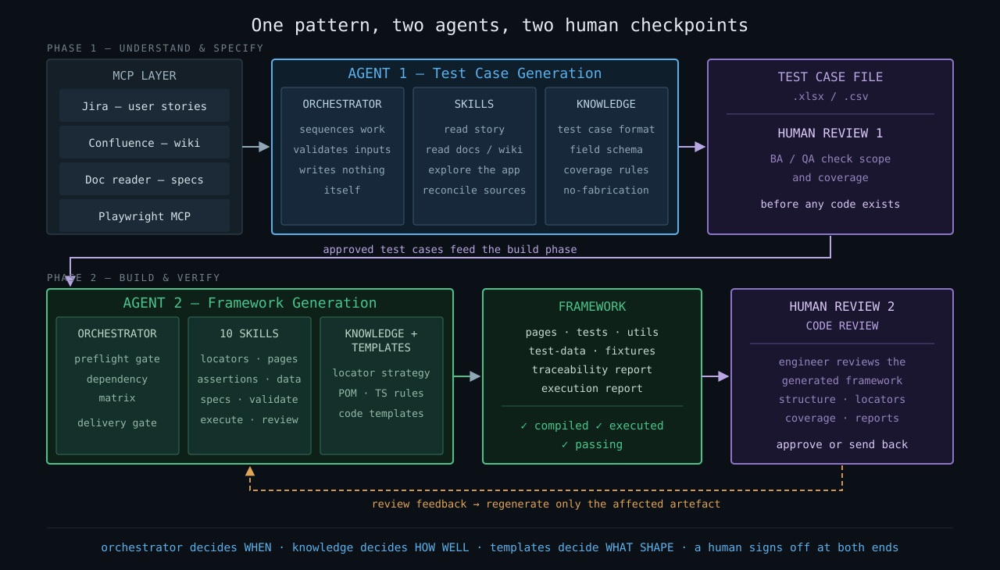
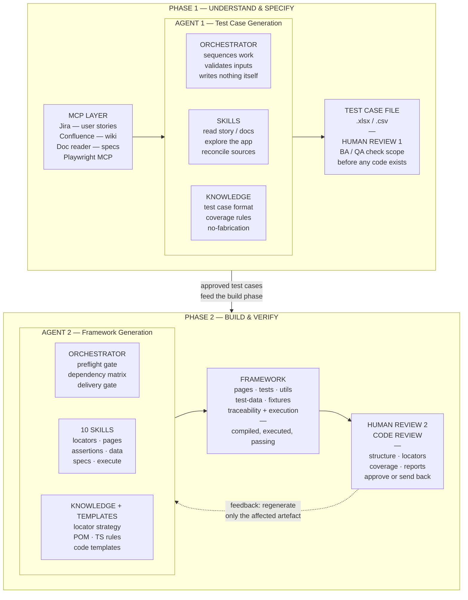

# AI-Driven Test Automation — End to End

Presentation content for the two-agent test automation solution.

**Agent 1** turns requirements into test cases. **Agent 2** turns test cases into a
verified Playwright framework. Together they run from a Jira user story to executed
automation with no manual authoring step in between.

---

> **For slides:** ready-made image files live in [`docs/diagrams/`](diagrams/).
> Download the `.svg` and use **Insert → Pictures → This Device** in PowerPoint —
> SVG stays sharp at any size, so there is no need to screenshot anything.
>
> | File | Size | Use for |
> |---|---|---|
> | [`01-end-to-end-flow.svg`](diagrams/01-end-to-end-flow.svg) | 1220 × 560 | the flow slide |
> | [`02-architecture.svg`](diagrams/02-architecture.svg) | 1280 × 730 (16:9) | the architecture slide |

---

## Diagram 1 — End-to-end flow



<details>
<summary>Mermaid source (editable)</summary>



</details>

**Two human checkpoints:** test cases are approved before any code is written,
and the generated framework is reviewed before it is accepted.

<details>
<summary><b>Plain-text version</b> (if the diagram above does not render in your viewer)</summary>

```text
SOURCES
    Jira user stories
    Functional documents
    Wiki / Confluence pages
    Live application  ..............  explored via Playwright MCP
        |
        v
AGENT 1  —  TEST CASE GENERATION
    reads the user story, functional docs and wiki pages
    explores the live application to observe real behaviour
    reconciles all sources, flags contradictions
    writes structured test cases
        |
        v
TEST CASE FILE  (.xlsx / .csv)   <====  HUMAN REVIEW POINT
    ID · module · preconditions · steps · data · expected result
    reviewed and signed off by BA / QA before any automation is built
        |
        v
AGENT 2  —  FRAMEWORK GENERATION   (10 skills)
    discovers stable locators from the live DOM
    generates Page Objects, assertions, test data, specs
    validates every rule, then compiles the code
    executes the suite for real and self-heals its own defects
        |
        v
GENERATED FRAMEWORK
    pages/  tests/  test-data/  utils/  fixtures/  hooks/
    traceability-report · execution-report · README
    [OK] compiled     [OK] executed     [OK] passing
        |
        v
CODE REVIEW   <====  HUMAN REVIEW POINT 2
    engineer reviews the generated framework and code
    structure · locators · coverage · reports
    approve, or send back for regeneration


TRACEABILITY CHAIN
    user story  ->  test case ID  ->  automated test
```

</details>

**Traceability chain:** user story → test case ID → automated test.

The test case file is deliberately a visible artefact rather than an internal hand-off,
so it stays reviewable and editable before automation is generated from it.

---

## Diagram 2 — Architecture

Laid out as two phases so it fits a 16:9 slide.



<details>
<summary>Mermaid source (editable)</summary>



</details>

<details>
<summary><b>Plain-text version</b> (if the diagram above does not render in your viewer)</summary>

```text
PHASE 1  —  UNDERSTAND & SPECIFY
===================================================================

  MCP LAYER          AGENT 1 — Test Case Generation      TEST CASE FILE
  ---------          ------------------------------      --------------
  Jira               ORCHESTRATOR   sequences work       .xlsx / .csv
    user stories                    validates inputs
  Confluence                        writes nothing       --------------
    wiki pages                                           HUMAN REVIEW 1
  Doc reader         SKILLS         read story / docs    --------------
    functional specs                explore the app      BA / QA check
  Playwright MCP                    reconcile sources    scope + coverage
    live browser
                     KNOWLEDGE      test case format     before any
                                    coverage rules       code exists
                                    no-fabrication

        +----------------> +----------------------> +
                                                    |
              approved test cases feed the build phase
        +<--------------------------------------------------+
        |
        v
PHASE 2  —  BUILD & VERIFY
===================================================================

  AGENT 2 — Framework Generation          FRAMEWORK        CODE REVIEW
  ------------------------------          ---------        -----------
  ORCHESTRATOR   preflight gate           pages · tests    HUMAN REVIEW 2
                 dependency matrix        utils · fixtures -----------
                 delivery gate            test-data        engineer reviews
                                                           the generated
  10 SKILLS      locators · pages         traceability     framework
                 assertions · data        + execution
                 specs · validate         reports          structure
                 execute · review                          locators
                                          -------------    coverage
  KNOWLEDGE +    locator strategy         [OK] compiled    reports
  TEMPLATES      POM · TS rules           [OK] executed    -----------
                 code templates           [OK] passing     approve
                                                           or send back

        +----------------> +----------------------> +
        ^                                           |
        |    feedback: regenerate only the          |
        +--- affected artefact <--------------------+


THE PATTERN, IN ONE LINE
    the orchestrator decides WHEN
    the knowledge files decide HOW WELL
    the templates decide WHAT SHAPE
    the skills are the only layer that produces output
    and a human signs off at both ends
```

</details>

Both agents share the same three-part pattern — orchestrator, skills, knowledge —
so the second was far cheaper to build than the first, and either can be extended
without touching the other.

The two review points matter as much as the automation: a human approves the test
cases before any code is written, and reviews the generated framework before it is
accepted. Review feedback regenerates only the affected artefact, not the whole
framework.

---

## 1. Manual process

**How it works today** — requirement → test cases → automation, entirely by hand.

### Test case authoring

- BA writes the user story in Jira; functional details live in separate documents
- QA reads the story, the functional doc, and related wiki pages separately
- QA manually explores the application to understand actual behaviour
- QA writes test cases by hand into Excel — steps, test data, expected results
- Test cases are reviewed with BA and development, then reworked

### Automation

- Automation engineer reads each test case and interprets it
- Opens the application and manually inspects the DOM to choose locators
- Hand-writes Page Objects, test data, and spec files
- Runs the suite, debugs failures, fixes locators, re-runs
- Maintains a traceability sheet manually, if at all
- Repeats the entire cycle for every change and every release

---

## 2. Manual process challenges

**Where it costs us** — time, consistency, coverage, and confidence.

- **Slow to deliver** — weeks of effort per module before a single test runs
- **Automation lags development** — testing becomes the release bottleneck
- **Quality varies by person** — two engineers produce two different frameworks for the same suite
- **Fragile locators** — hand-picked selectors break on minor UI changes
- **Duplication** — the same login, waits and helpers rewritten across spec files
- **Weak traceability** — hard to prove which requirement a test actually covers
- **Coverage gaps** — scenarios missed because sources were read in isolation
- **Documentation drift** — Jira, functional docs and wiki disagree; nobody reconciles them
- **Rework on change** — a requirement change means manually revisiting test cases and code
- **Skill dependency** — needs experienced SDETs; onboarding is slow
- **Knowledge silos** — framework conventions live in people's heads, not in writing
- **Unverified handover** — "automation complete" often means written, not proven to pass

---

## 3. AI-driven process implemented

**Two specialised agents, one continuous chain** — requirement in, verified automation out.

### Agent 1 — Test Case Generation

- Reads the user story directly from Jira
- Reads the functional document and related wiki / Confluence pages
- Explores the live application through Playwright MCP to observe real behaviour
- Reconciles all sources and flags contradictions instead of guessing
- Produces structured test cases — ID, module, preconditions, steps, data, expected result
- Outputs to Excel / CSV, so BA and QA can review before anything is automated

### Agent 2 — Framework Generation

- Parses every test case into a canonical model
- Explores the application to confirm each step is genuinely performable
- Discovers stable locators from the live DOM, not from assumption
- Generates Page Objects, verification methods, test data and specs
- Validates against every framework rule, then compiles the code
- Executes the suite for real, diagnoses failures and repairs its own defects
- Issues a production-readiness decision backed by actual execution results

### Guardrails built in

- Nothing is invented — every test traces back to a test case ID, every test case to a source
- A test is never weakened to force a pass; real application defects are reported, not masked
- Delivery is blocked until every test case has a genuine per-browser result

---

## 4. Advantages

**What this gives us** — beyond raw speed.

- **One continuous chain** — requirement to executed automation with no manual re-typing between stages
- **Full traceability** — user story → test case ID → automated test, generated automatically
- **Consistent architecture** — same structure, naming and locator strategy every single run
- **Standards enforced by design** — Page Object Model, no hardcoded waits, no duplicated logic
- **Self-verifying output** — the framework ships executed and passing, not merely written
- **Human checkpoint preserved** — test cases stay reviewable before automation is built from them
- **Contradictions surfaced** — mismatches between docs and the real application are reported, not silently resolved
- **Lower skill barrier** — teams get quality automation without deep Playwright expertise on day one
- **Scales without headcount** — more test cases no longer means proportionally more engineers
- **Cheap to re-run** — a requirement change regenerates the affected tests instead of triggering manual rework
- **Audit-friendly** — coverage and execution evidence produced as reports, which matters in regulated environments
- **Knowledge captured in writing** — conventions live in versioned rule files, not in individual heads

---

## 5. Efficiency gained with current implementation

> **Fill the right column from your own runs before presenting.** No invented
> percentages — a single measured module is far more persuasive than a round
> number nobody can source, and an unsourced figure undermines the credible
> slides around it.

| Activity | Manual | With agents |
|---|---|---|
| Reading sources & understanding scope | `[ __ hrs ]` | minutes |
| Writing test cases for one module | `[ __ days ]` | `[ __ min ]` |
| Building the automation framework | `[ __ weeks ]` | `[ __ min ]` |
| Locator discovery & debugging | `[ __ hrs ]` | included |
| First successful suite execution | `[ __ days ]` | same run |
| Traceability matrix | `[ __ hrs, manual ]` | auto-generated |
| Rework after a requirement change | `[ __ days ]` | `[ __ min ]` |

### Qualitative gains — safe to state without numbers

- Automation is no longer the release bottleneck — it keeps pace with development
- Engineers move from writing boilerplate to reviewing coverage and investigating real defects
- Framework quality no longer depends on who was assigned the work
- Coverage evidence is produced as a by-product rather than chased at audit time
- Onboarding is faster — conventions are documented and enforced, not taught informally

---

## 6. Architecture — technology required

### Agent runtime

- LLM agent runtime capable of tool use and file operations
- Markdown-based specification — orchestrator, skills, knowledge and template files
- Version control (Git) for the spec, so rules are reviewable and auditable

### MCP connectors

- **Playwright MCP** — drives a real browser for live application exploration and DOM inspection
- **Jira integration** — reads user stories, acceptance criteria and linked issues
- **Confluence / wiki access** — reads supporting documentation
- **Document reader** — parses functional specification files

### Test framework stack

- Playwright test runner with TypeScript
- Node.js runtime and package management
- Browser binaries — a corporate-approved browser is fully supported
- Page Object Model architecture with fixtures, hooks and shared utilities
- Playwright HTML reporter for execution evidence

### Architectural pattern — shared by both agents

- **Orchestrator** — sequences the work and enforces gates; never produces content itself
- **Skills** — the only layer that generates output; each does exactly one job
- **Knowledge files** — engineering standards that constrain quality
- **Templates** — fix the shape of what gets produced
- **Dependency matrix** — one table declaring what each skill may load, so a new standard cannot silently miss a step

---

## 7. Pre-requisites

Verified automatically by the preflight gate — the run stops before generating
anything if any of these are missing.

### Access & credentials

- Jira access with permission to read the target user stories
- Confluence / wiki read access
- Functional documents available in a readable location
- Application URL for a stable test environment
- Valid test credentials that can complete login

### Environment

- Node.js installed
- Initialised Playwright project — `package.json`, `tsconfig.json`, `playwright.config.ts`
- Dependencies installed and at least one approved browser available and able to launch
- Browser path configured in `playwright.config.ts` where a corporate binary is used
- Project compiles cleanly before generation begins
- Test environment reachable from the machine running the agent

### Configuration

- Playwright MCP configured and connected
- Jira and wiki connectors configured
- Agent specification files present — orchestrator, skills, knowledge, templates
- Target folder structure in place, matching the project's own conventions

### Ways of working

- User stories carry enough acceptance detail to derive test cases
- A named reviewer signs off generated test cases before automation is built
- Agreement on which environments the agent may run against — never production
===================My Notes ===============================
Good afternoon, everyone. Thanks for joining.

Team, I want to walk you through something we've been building — a smarter way to do test automation using AI. Before I show you the solution, let me spend a minute on the problem, because I think a lot of you will relate to this.

Team, in the traditional approach, when a new requirement comes in, a BA writes a user story in Jira. The functional details usually live somewhere else — in a separate document. QA has to read the story, then the functional doc, then check the wiki, and on top of all that, manually explore the application to understand how it actually behaves. Only after doing all of that do they sit down and write test cases by hand into Excel — steps, test data, expected results, and so on.

And that's just the first half. Then it goes to automation. An automation tester reads each test case, opens dev tools, manually picks out locators, writes the spec files, writes the test files, and runs the suite — and then the real work starts: debugging, fixing broken locators, and running it again.

Now — where does this actually cost us?

A few things stand out:

1. First, it's slow — weeks of effort before a single automated test even runs.
2. Second, it's inconsistent — give the same suite to two different people, and you'll get two different frameworks back.
3. Third, locators break easily — a small UI change, and half the suite fails.

Put it all together, and automation — which is supposed to make releases faster and safer — ends up becoming the bottleneck itself.

To overcome this problem, we've designed a solution. We've created two agents that work one after another to help us reach the end goal. Agent one writes test cases in plain English, and the second agent converts them into test scripts.

---

**Slide — Traditional Software Testing Life Cycle**

We all know this traditional software testing life cycle. We analyze the requirements by reading multiple documents. Once analysis is done, we design the test cases, and a BA review follows. Then we do functional testing. Later, automation comes into the picture — we do test case analysis, an application walkthrough, and based on that, we design the automation framework.

---

**Slide — Agentic Software Testing Life Cycle**

We've introduced this agentic software testing life cycle. The cycle stays the same — we've just replaced humans with agents at a few places.

You can see that requirement analysis and test case creation are now completely done by an agent. After that, we've added a human checkpoint, where the BA or manual tester verifies whether the test cases are correct and whether they cover all the functionality.

Once approved, we pass those test cases to the second agent. This agent analyzes the test cases, examines the application using Playwright MCP, and designs the test scripts. Then we've added one more human checkpoint — the automation tester verifies whether the test scripts are correct. They check traceability, confirming a 1:1 mapping between test cases and test scripts.