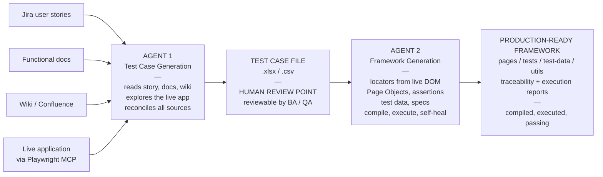
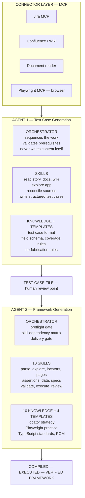

# AI-Driven Test Automation — End to End

Presentation content for the two-agent test automation solution.

**Agent 1** turns requirements into test cases. **Agent 2** turns test cases into a
verified Playwright framework. Together they run from a Jira user story to executed
automation with no manual authoring step in between.

---

## Diagram 1 — End-to-end flow

**Traceability chain:** user story → test case ID → automated test.

The test case file is deliberately a visible artefact rather than an internal hand-off,
so it stays reviewable and editable before automation is generated from it.

---

## Diagram 2 — Architecture

Both agents share the same three-part pattern — orchestrator, skills, knowledge —
so the second was far cheaper to build than the first, and either can be extended
without touching the other.

---

## 1. Manual process

**How it works today** — requirement → test cases → automation, entirely by hand.

### Test case authoring

- BA writes the user story in Jira; functional details live in separate documents
- QA reads the story, the functional doc, and related wiki pages separately
- QA manually explores the application to understand actual behaviour
- QA writes test cases by hand into Excel — steps, test data, expected results
- Test cases are reviewed with BA and development, then reworked

### Automation

- Automation engineer reads each test case and interprets it
- Opens the application and manually inspects the DOM to choose locators
- Hand-writes Page Objects, test data, and spec files
- Runs the suite, debugs failures, fixes locators, re-runs
- Maintains a traceability sheet manually, if at all
- Repeats the entire cycle for every change and every release

---

## 2. Manual process challenges

**Where it costs us** — time, consistency, coverage, and confidence.

- **Slow to deliver** — weeks of effort per module before a single test runs
- **Automation lags development** — testing becomes the release bottleneck
- **Quality varies by person** — two engineers produce two different frameworks for the same suite
- **Fragile locators** — hand-picked selectors break on minor UI changes
- **Duplication** — the same login, waits and helpers rewritten across spec files
- **Weak traceability** — hard to prove which requirement a test actually covers
- **Coverage gaps** — scenarios missed because sources were read in isolation
- **Documentation drift** — Jira, functional docs and wiki disagree; nobody reconciles them
- **Rework on change** — a requirement change means manually revisiting test cases and code
- **Skill dependency** — needs experienced SDETs; onboarding is slow
- **Knowledge silos** — framework conventions live in people's heads, not in writing
- **Unverified handover** — "automation complete" often means written, not proven to pass

---

## 3. AI-driven process implemented

**Two specialised agents, one continuous chain** — requirement in, verified automation out.

### Agent 1 — Test Case Generation

- Reads the user story directly from Jira
- Reads the functional document and related wiki / Confluence pages
- Explores the live application through Playwright MCP to observe real behaviour
- Reconciles all sources and flags contradictions instead of guessing
- Produces structured test cases — ID, module, preconditions, steps, data, expected result
- Outputs to Excel / CSV, so BA and QA can review before anything is automated

### Agent 2 — Framework Generation

- Parses every test case into a canonical model
- Explores the application to confirm each step is genuinely performable
- Discovers stable locators from the live DOM, not from assumption
- Generates Page Objects, verification methods, test data and specs
- Validates against every framework rule, then compiles the code
- Executes the suite for real, diagnoses failures and repairs its own defects
- Issues a production-readiness decision backed by actual execution results

### Guardrails built in

- Nothing is invented — every test traces back to a test case ID, every test case to a source
- A test is never weakened to force a pass; real application defects are reported, not masked
- Delivery is blocked until every test case has a genuine per-browser result

---

## 4. Advantages

**What this gives us** — beyond raw speed.

- **One continuous chain** — requirement to executed automation with no manual re-typing between stages
- **Full traceability** — user story → test case ID → automated test, generated automatically
- **Consistent architecture** — same structure, naming and locator strategy every single run
- **Standards enforced by design** — Page Object Model, no hardcoded waits, no duplicated logic
- **Self-verifying output** — the framework ships executed and passing, not merely written
- **Human checkpoint preserved** — test cases stay reviewable before automation is built from them
- **Contradictions surfaced** — mismatches between docs and the real application are reported, not silently resolved
- **Lower skill barrier** — teams get quality automation without deep Playwright expertise on day one
- **Scales without headcount** — more test cases no longer means proportionally more engineers
- **Cheap to re-run** — a requirement change regenerates the affected tests instead of triggering manual rework
- **Audit-friendly** — coverage and execution evidence produced as reports, which matters in regulated environments
- **Knowledge captured in writing** — conventions live in versioned rule files, not in individual heads

---

## 5. Efficiency gained with current implementation

> **Fill the right column from your own runs before presenting.** No invented
> percentages — a single measured module is far more persuasive than a round
> number nobody can source, and an unsourced figure undermines the credible
> slides around it.

| Activity | Manual | With agents |
|---|---|---|
| Reading sources & understanding scope | `[ __ hrs ]` | minutes |
| Writing test cases for one module | `[ __ days ]` | `[ __ min ]` |
| Building the automation framework | `[ __ weeks ]` | `[ __ min ]` |
| Locator discovery & debugging | `[ __ hrs ]` | included |
| First successful suite execution | `[ __ days ]` | same run |
| Traceability matrix | `[ __ hrs, manual ]` | auto-generated |
| Rework after a requirement change | `[ __ days ]` | `[ __ min ]` |

### Qualitative gains — safe to state without numbers

- Automation is no longer the release bottleneck — it keeps pace with development
- Engineers move from writing boilerplate to reviewing coverage and investigating real defects
- Framework quality no longer depends on who was assigned the work
- Coverage evidence is produced as a by-product rather than chased at audit time
- Onboarding is faster — conventions are documented and enforced, not taught informally

---

## 6. Architecture — technology required

### Agent runtime

- LLM agent runtime capable of tool use and file operations
- Markdown-based specification — orchestrator, skills, knowledge and template files
- Version control (Git) for the spec, so rules are reviewable and auditable

### MCP connectors

- **Playwright MCP** — drives a real browser for live application exploration and DOM inspection
- **Jira integration** — reads user stories, acceptance criteria and linked issues
- **Confluence / wiki access** — reads supporting documentation
- **Document reader** — parses functional specification files

### Test framework stack

- Playwright test runner with TypeScript
- Node.js runtime and package management
- Browser binaries — a corporate-approved browser is fully supported
- Page Object Model architecture with fixtures, hooks and shared utilities
- Playwright HTML reporter for execution evidence

### Architectural pattern — shared by both agents

- **Orchestrator** — sequences the work and enforces gates; never produces content itself
- **Skills** — the only layer that generates output; each does exactly one job
- **Knowledge files** — engineering standards that constrain quality
- **Templates** — fix the shape of what gets produced
- **Dependency matrix** — one table declaring what each skill may load, so a new standard cannot silently miss a step

---

## 7. Pre-requisites

Verified automatically by the preflight gate — the run stops before generating
anything if any of these are missing.

### Access & credentials

- Jira access with permission to read the target user stories
- Confluence / wiki read access
- Functional documents available in a readable location
- Application URL for a stable test environment
- Valid test credentials that can complete login

### Environment

- Node.js installed
- Initialised Playwright project — `package.json`, `tsconfig.json`, `playwright.config.ts`
- Dependencies installed and at least one approved browser available and able to launch
- Browser path configured in `playwright.config.ts` where a corporate binary is used
- Project compiles cleanly before generation begins
- Test environment reachable from the machine running the agent

### Configuration

- Playwright MCP configured and connected
- Jira and wiki connectors configured
- Agent specification files present — orchestrator, skills, knowledge, templates
- Target folder structure in place, matching the project's own conventions

### Ways of working

- User stories carry enough acceptance detail to derive test cases
- A named reviewer signs off generated test cases before automation is built
- Agreement on which environments the agent may run against — never production
